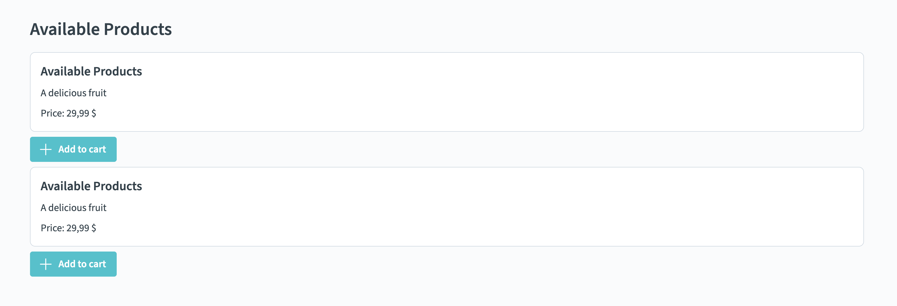
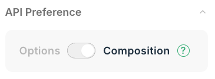

# Exercise 01 Components

The goal of this exercise is to create your own components and display them on the home page.

## 📝 Tasks

- [ ] Implement the newly created Vue component called `ProductCard` in [\./src/components/](./src/components/).
- [ ] Fill it with content by adding static arbitrary title, description, price, and "Add to cart"-button
  > - [ ] 💪 Bonus challenge: Use `OnyxHeadline`, `OnyxCard`, and `OnyxButton` where possible!
- [ ] Fill in the content for another component `ProductList` which we created. Add a title "Available Products" and render two `ProductCard` components
- [ ] Display `ProductList` on the home page (see [\./src/views/HomeView.vue](./src/views/HomeView.vue))

## 🖼️ Example Result

## 💡 Help

- [Available HTML Elements](https://developer.mozilla.org/en-US/docs/Web/HTML/Reference/Elements)
- Onyx design system / components:
  - [General Documentation](https://onyx.schwarz)
  - [Components Demo / Storybook](https://storybook.onyx.schwarz/)
- Vue Documentation: [Component Basics](https://vuejs.org/guide/essentials/component-basics)
  > ⚠️ Always ensure that the Vue docs are configured for the **Composition API**, not Options API!
  >
  > 
