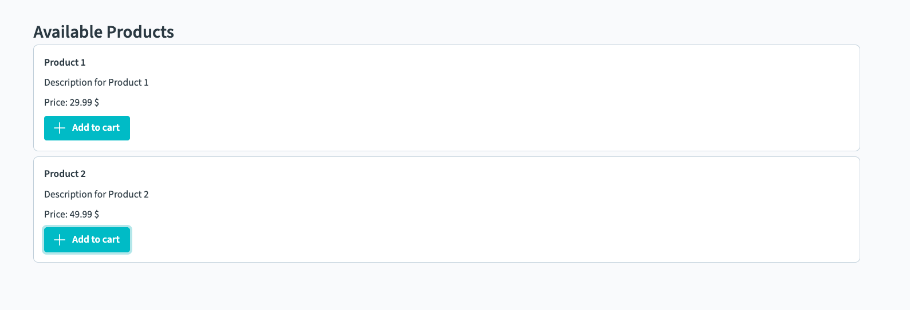

# Exercise 02 Input Output

The goal of this exercise is to pass data from component to component, display it in the template, and emit and respond to events.

## 📝 Tasks

- [ ] `ProductCard`:
  - [ ] Enable `ProductCard` to receive product `id`, `title`, `description`, and `price` from its parent
  - [ ] Display `id`, `title`, `description`, and `price` in the template
  - [ ] Emit an event with the product ID when the user clicks on the "Add to cart"-button

- [ ] `ProductList`:
  - [ ] Use the `getProducts` method from `@/shared/products` to get a list of products
    > ⚠️ Use `getProducts` **only** inside of the `ProductList` component!
  - [ ] Show the information of the **first two** products in the `ProductList` (one `ProductCard` each)
  - [ ] Handle the event from `ProductCard` and log the ID to the console, e.g. using `console.log(...)`

## 🖼️ Example Result

## 💡 Help

- Onyx design system / components:
  - [General Documentation](https://onyx.schwarz)
  - [Components Demo / Storybook](https://storybook.onyx.schwarz/)
- Vue Documentation:
  - [Props](https://vuejs.org/guide/components/props.html)
  - [Events](https://vuejs.org/guide/components/events.html) and [Event Handling](https://vuejs.org/guide/essentials/event-handling.html)
