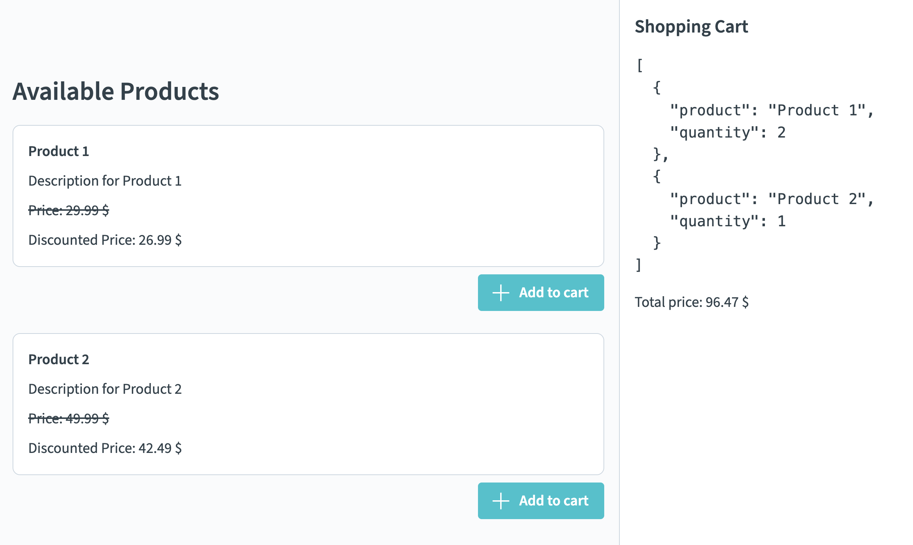

# Exercise 03 (A) Reactivity - Computed Properties

The goals of this exercise is to use Vue computed properties to calculate derived values.

## 📝 Tasks

- [ ] `HomeView`:
  - [ ] Add an `OnyxSidebar` to the `HomeView` and make it display the newly created [`ShoppingCart`](./src/components/ShoppingCart.vue) component
  - [ ] Create a state for the list of `ShoppingCartItem`s within the `HomeView` component. The HomeView component should then pass this state to the component that requires it. In the end, the `ProductList` should be able to add items to the cart

- [ ] `ShoppingCart`:
  - [ ] Render the javascript object for the cart items within this sidebar
    - [ ] 💪 Bonus challenge: Transform the list of items to only show the title and quantity
  - [ ] Use a computed property to display the total price of all items

- [ ] `ProductList`:
  - [ ] Enable the `ProductList` component to add items to the shopping cart
  - [ ] 💪 Bonus challenge: Render the discounted price beside the price

## 🖼️ Example Result

## 💡 Help

- Onyx design system / components:
  - [General Documentation](https://onyx.schwarz)
  - [Components Demo / Storybook](https://storybook.onyx.schwarz/)
- Vue Documentation:
  - [Reactivity Fundamentals](https://vuejs.org/guide/essentials/reactivity-fundamentals.html)
  - [List Rendering](https://vuejs.org/guide/essentials/list.html)
  - [Conditional Rendering](https://vuejs.org/guide/essentials/conditional.html)
  - [v-model](https://vuejs.org/guide/components/v-model.html)
  - [Computed Properties](https://vuejs.org/guide/essentials/computed.html)
