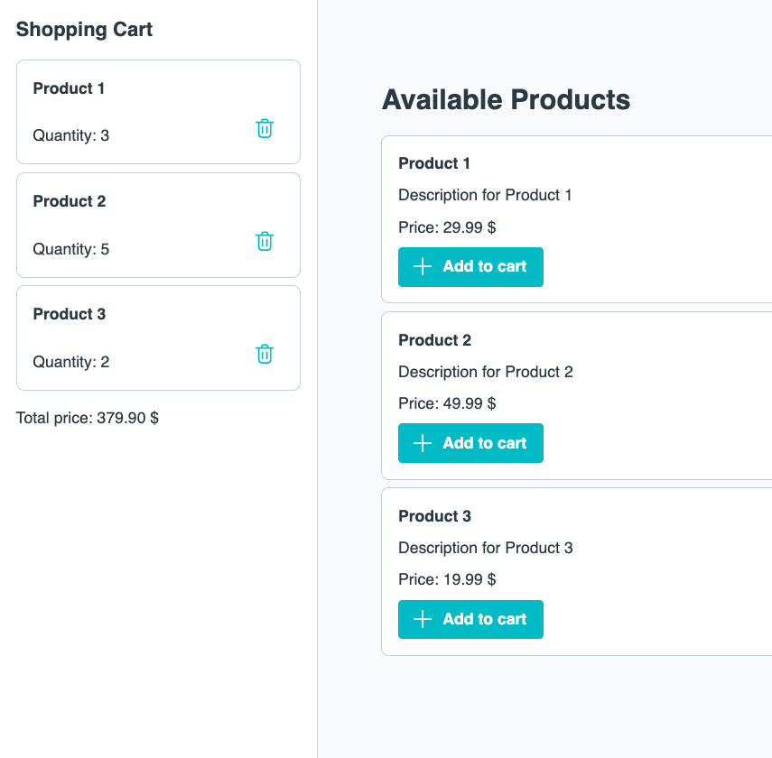

# Exercise 03 (B) Reactivity - Directives

The goals of this exercise are

- to use Vue directives and display dynamic data in the template
- to use reactive state and implement the addition and removal of items to and from the shopping cart

## 📝 Tasks

- [ ] `ShoppingCart`:
  - [ ] Display all shopping cart items dynamically via directives
  - [ ] Enable the `ShoppingCart` component to delete items from the shopping cart
    > - [ ] 💪 Bonus challenge: Use `v-model`

- [ ] `ProductList`:
  - [ ] Display all products in the product list with their name, description and price dynamically via directives
  - [ ] Show "No products available..." instead of the `ProductList` if no products are available

## 🖼️ Example Result

## 💡 Help

- Onyx design system / components:
  - [General Documentation](https://onyx.schwarz)
  - [Components Demo / Storybook](https://storybook.onyx.schwarz/)
- Vue Documentation:
  - [Reactivity Fundamentals](https://vuejs.org/guide/essentials/reactivity-fundamentals.html)
  - [List Rendering](https://vuejs.org/guide/essentials/list.html)
  - [Conditional Rendering](https://vuejs.org/guide/essentials/conditional.html)
  - [v-model](https://vuejs.org/guide/components/v-model.html)
  - [Computed Properties](https://vuejs.org/guide/essentials/computed.html)
