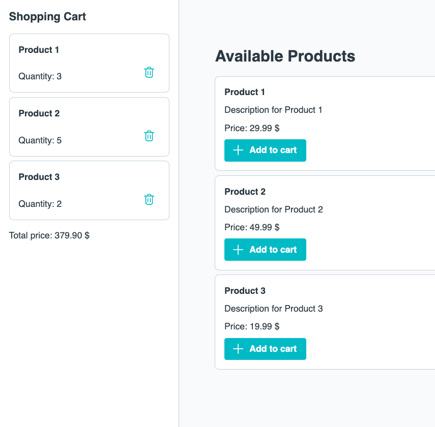

# Exercise 04 Reactivity

The goals of this exercise are

- to use Vue directives and display dynamic data in the template
- to use reactive state and implement the addition and removal of items to and from the shopping cart

## 📝 Tasks

- [ ] `HomeView`:
  - [ ] Add an `OnyxSidebar` to the `HomeView` and make it display our `ShoppingCart` component
  - [ ] Store the shopping cart state (= a list of `ShoppingCartItem`s) in `HomeView`. The component should pass this state to every other component that requires it.
  - In the end, the `ProductList` should be able to add items to the cart while the `ShoppingCart` should be able to remove items from the cart.

- [ ] `ShoppingCart`:
  - [ ] Display all shopping cart items
  - [ ] Enable `ShoppingCart` to delete items from the shopping cart
    > - [ ] 💪 Bonus challenge: Use `v-model`
  - [ ] Display the total price of all items
    > - [ ] 💪 Bonus challenge: Use a computed property

- [ ] `ProductList`:
  - [ ] Display all products in the product list
  - [ ] Enable `ProductList` to add items to the shopping cart
  - [ ] Show "No products available..." instead of the `ProductList` if no products are available

## 🖼️ Example Result

## 💡 Help

- Onyx design system / components:
  - [General Documentation](https://onyx.schwarz)
  - [Components Demo / Storybook](https://storybook.onyx.schwarz/)
- Vue Documentation:
  - [Reactivity Fundamentals](https://vuejs.org/guide/essentials/reactivity-fundamentals.html)
  - [List Rendering](https://vuejs.org/guide/essentials/list.html)
  - [Conditional Rendering](https://vuejs.org/guide/essentials/conditional.html)
  - [v-model](https://vuejs.org/guide/components/v-model.html)
  - [Computed Properties](https://vuejs.org/guide/essentials/computed.html)
