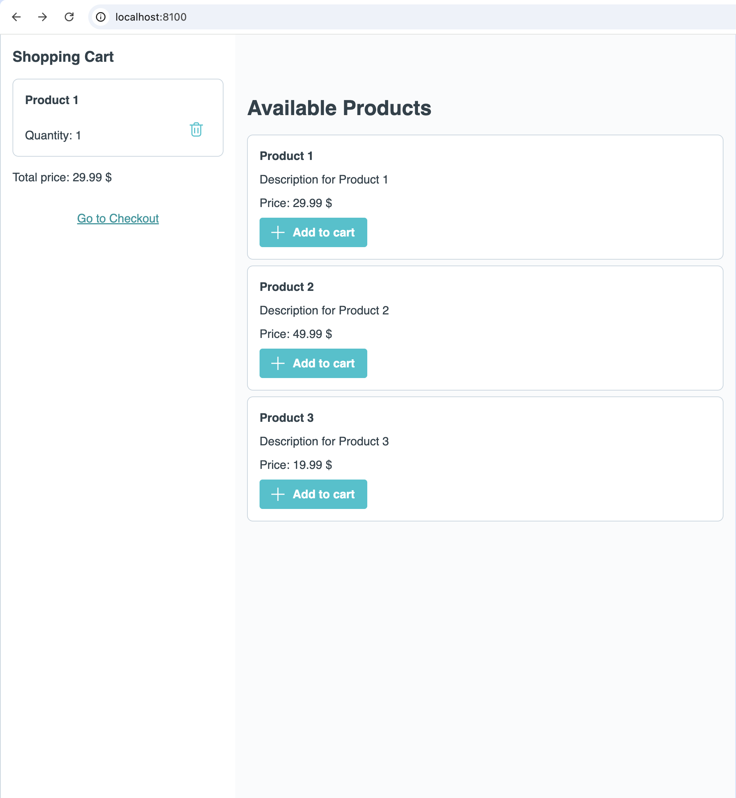
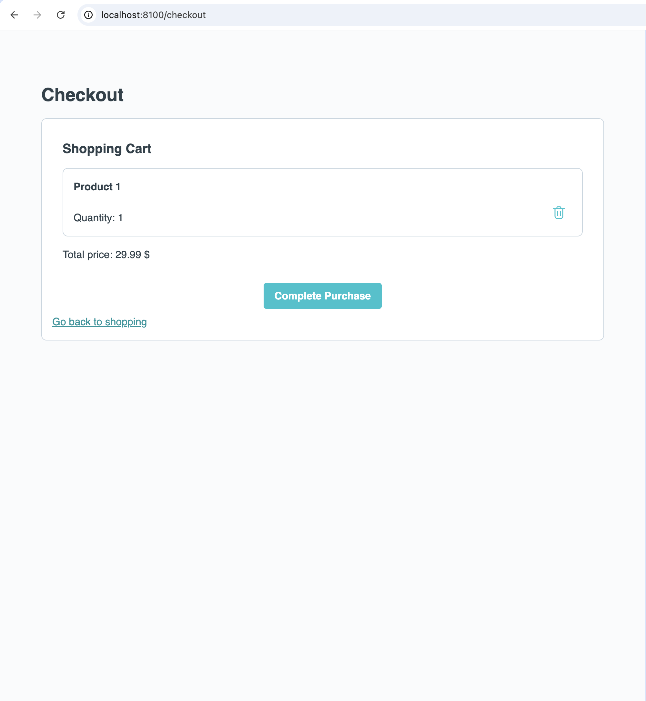

# Exercise 05 Vue-Router

The goal of this exercise is to set up vue-router and add navigation between two routes.

## 📝 Tasks

- [ ] Set up vue-router
  - [ ] `App.vue` should now display the RouterView
  - [ ] There should be two registered routes, `/` and `/checkout`
  - [ ] `/checkout` should render `CheckoutView.vue`, which was already created for you
- [ ] In the sidebar inside `HomeView.vue`, add a link to the checkout page
- [ ] On the checkout page, add a link to the home page

## 🖼️ Example Result

## 💡 Help

- Vue Router Documentation: [vue-router docs](https://router.vuejs.org/guide/)
