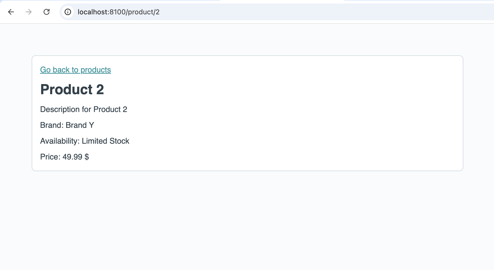

# Exercise 07 Dynamic Routes

The goal of this exercise is to add a dynamic route to a product detail page for each product.

## Tasks

- [ ] Add a dynamic route to the router with the following properties:
  - [ ] It should match the route `/product`
  - [ ] It should take a route parameter called `productId`
  - [ ] It should render the component `ProductView.vue`
- [ ] `ProductCard.vue`:
  - [ ] When clicking on the `<OnyxCard />` in the `ProductCard.vue` component, the router should navigate to the `/product` route with the proper ID as the `productId` parameter
- [ ] Complete the `ProductView.vue` component by doing the following:
  - [ ] Retrieve the product ID from the route params to fetch the specific product for each route
  - [ ] In the template, display the product ID, taken from the route params, in the OnyxHeadline

> Pro challenge 💪: Add a redirect if the product can't be found
>
> - [ ] The redirect should go to `/product-not-found` and should mount `NotFoundView.vue`

## Example Result

## Help

For more information on dynamic routes with vue-router, please refer to the [vue-router documentation](https://router.vuejs.org/guide/advanced/dynamic-routing).
