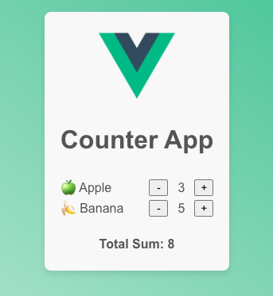

# Exercise 01 Why Vue

The goals of this exercise are

- to build a small web app with vanilla JavaScript in order to see what Vue is capable of.

## 📝 Tasks

- [ ] Implement the `updateTotalSum` function that takes the element with the class `total-sum-counter` and sets the summed up value of all entries.
- [ ] Implement the appendCounterToEntry function that creates a entry for the grocery with a clickable counter.

## 🖼️ Example Result

## 💡 Help

- Start app from `./vue` with `pnpm dev` to see how it works in vue
